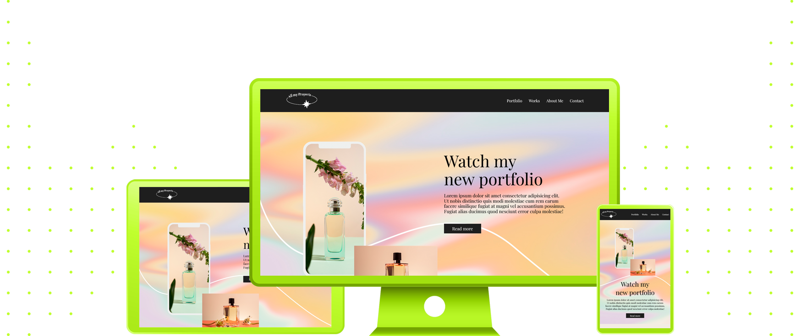

 
 

|         |               
| :-------------:|
|   |
| **Website Template #01:** Futuristic Personal Portfolio   | 
| **Original Project:** [🌐](https://github.com/malunaridev/Full-Pages-Are-Also-Fun/blob/master/1-futuristic-personal-portfolio/assets/Readme-files/example.jpg?raw=true) / **My Code:** [📄](https://github.com/malunaridev/Full-Pages-Are-Also-Fun/tree/master/1-futuristic-personal-portfolio) / **Live Preview:** [🌐](https://fpaaf-futuristic-personal-portfolio.vercel.app/)  

 
 

This was my first time trying a whole webpage!
All the words are not enough to express how I feel about not only building a whole page from scratch, but also making it responsive for many screen widths! 

 
 
 

- HTML
- CSS

 
 
 

|  Validator  | Passed |
| ------------- | :-------------: |
|[Markup Validation Service](https://validator.w3.org/) - <em>w3.org</em> |   |
|[CSS Validation Service](https://jigsaw.w3.org/css-validator/) - <em>w3.org</em> |   |

 
 
 

I won't lie, it took me a while, specially the responsive part, but it was also tremendous rewarding!
The best part is to know that I can do something big, and I will do even bigger things in the future. I am so glady happy!

 
 
 

